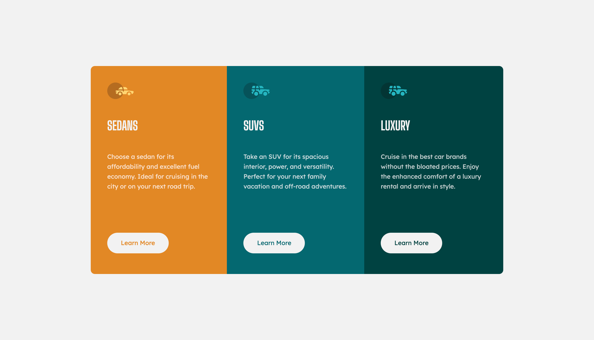
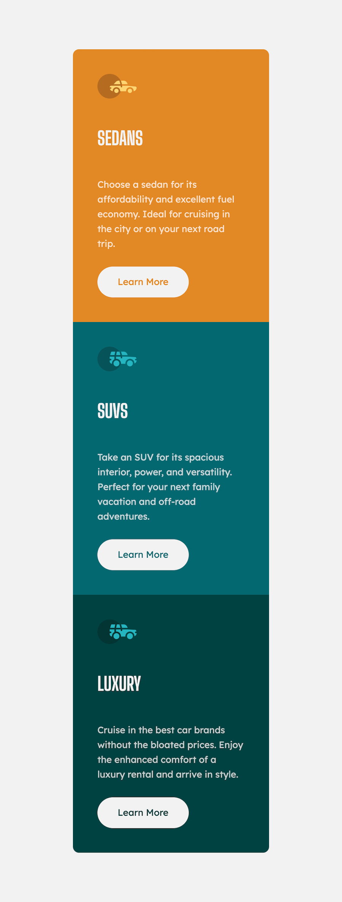

# 3-column preview card component

- [Overview](#overview)
  - [Live Preview](#Live-preview)
  - [Screenshot](#screenshot)
- [My process](#my-process)
  - [Built with](#built-with)
  - [What I learned](#what-i-learned)
  - [Continued development](#continued-development)
  - [Acknowledgements](#acknowledgements)

## Overview

### Live preview

[👉 Click Here](https://bhornbhaya.github.io/3-column-preview-card/)

### Screenshot

## My process

### Built with

- Semantic HTML5 Markup
- CSS
- Flexbox
- Sass

### What I learned

- How to think about the overall layout of a card
- Use flexbox in a real world project
- How to find, generate and use SVG in HTML
- Flexbox alignment methods
- How to use scaleY and multiple transition properties with different settings, to create an active effect

### Continued development

- Add dark mode feature

## Acknowledgements

Challenge by [Frontend Mentor](https://www.frontendmentor.io?ref=challenge)
Coded by [me](https://www.linkedin.com/in/bhornbhaya/)
